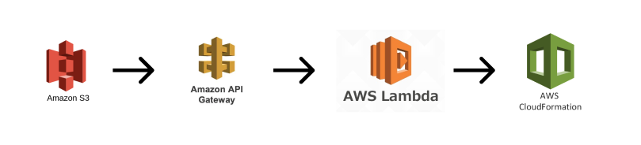

> Description

Create a CloudFormation Stack from a user input to a static website.
- `index.html` is hosted on s3.
- `lambda_function.py` is a AWS Lambda function that performs the stack creation.

Also, an API Gateway is needed to create an endpoint for the lambda function. So, we need an HTTP API with CORS enabled.

> Note 

The Lambda function needs to be granted with necessary permissions to access aws resources.

